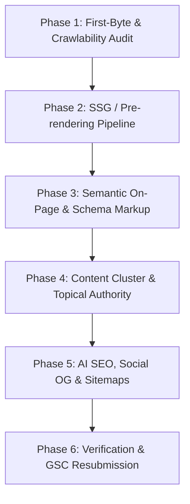

# Universal SEO Overhaul & Fixing Playbook for AI Agents

> **Battle-tested framework** for auditing, repairing, and outranking competitors on search engines and AI answer engines. Optimized for modern web applications (SPAs, SSR, SSG).

---

## Quick Start: The Master Agent Prompt

Copy the prompt block below directly into your AI coding assistant (Antigravity, Claude Code, Cursor, Copilot, etc.) inside your target project's repository.

```markdown
You are an expert Technical SEO Engineer, Content Strategist, and Frontend Architect.
Your task is to conduct a complete SEO overhaul of this web project, identify all crawlability, architecture, and content ranking bottlenecks, and execute the fixes directly in the codebase.

### Project Context & Parameters
- Project Name: Syubban Fakhriya Portfolio
- Primary Domain / Base URL: https://mattrmost.com
- Framework & Tech Stack: Vite + React 18 + TypeScript + Tailwind CSS (Zero-Dependency SSG)
- Hosting Platform: Cloudflare Pages
- Core Target Keywords / Intent: Syubban Fakhriya, Full-Stack Developer Indonesia, Java Spring Boot Software Engineer, Kotlin Android Developer, VentNote, VentFit, InvestCount
- Installed Skills / Agent Standards: .agents/skills/seo-audit, .agents/skills/firecrawl-seo-audit, .agents/skills/ai-seo, .agents/skills/programmatic-seo
- Search Console / Performance Symptoms: Previous ranking drops caused by hardcoded canonical to homepage, empty first-byte CSR HTML, and sitemap slug mismatches (all resolved via SSG pipeline)

---

### Step 1: Technical & Crawlability Audit (First-Byte Inspection)
1. **Analyze First-Byte HTML**:
   - Check what web crawlers (Googlebot, Bingbot) actually receive on first byte before JavaScript executes.
   - If this is a Client-Side Rendered (CSR) SPA serving an empty `<div id="root"></div>`, diagnose how to introduce Pre-rendering / Static Site Generation (SSG) or Server-Side Rendering (SSR) without disrupting current state logic or requiring a heavy framework migration.
2. **URL Normalization & Canonicals**:
   - Ensure every page outputs a dynamic `<link rel="canonical" href="...">`.
   - Prevent duplicate indexation of trailing slashes vs non-trailing slashes (configure 301 redirects in `_redirects` or server config).
   - Consolidate legacy or redundant routes with permanent 301 redirects to the primary route.
3. **Hydration & SSR Safety**:
   - Guard any `window`, `document`, or `localStorage` calls with `typeof window !== 'undefined'` to avoid build-time SSR crashes.

---

### Step 2: Competitor Counter-Strategy & On-Page Intent
1. **Outranking Strategy Against High-Authority Competitors**:
   - Analyze top ranking competitors: Big institutions often rely on Domain Authority (DA) but have thin, single-product landing pages with zero educational context or neutral comparisons.
   - Position this project as the **definitive, neutral, multi-option solution** with richer utility and deeper domain depth.
2. **Semantic Structure & Above-the-Fold Optimization**:
   - Ensure exactly one primary `<h1>` per page containing the core high-volume target keyword and a clear value hook.
   - Follow strict heading hierarchy (`h1` -> `h2` -> `h3`).
3. **Rich Content & FAQ Section**:
   - Add a high-intent educational content section and interactive FAQ accordion directly below the main utility/tool.
   - Formulate questions based on actual search queries (e.g., calculation formulas, taxes, legal regulations, comparative advantages).
   - Inject valid JSON-LD `FAQPage` schema corresponding 1-to-1 with the FAQ questions.

---

### Step 3: Structured Data & Rich Snippets (Schema.org)
1. Implement JSON-LD schemas across all relevant views:
   - `WebApplication` / `SoftwareApplication` (Application category, operating system, rating, free pricing).
   - `FAQPage` (for accordion Q&A).
   - `Article` / `BlogPosting` (for guides/blog posts with `headline`, `author`, `datePublished`, `dateModified`).
   - `BreadcrumbList` (for nested navigation routes).
2. Validate that all schema properties adhere to Google's Structured Data Guidelines and contain no circular references.

---

### Step 4: Content Cluster & Topical Authority Expansion
1. **Topical Authority Hub**:
   - Identify primary keyword variants and user search journeys (e.g., tax rules, interest calculation math, comparison against other asset classes).
   - Build or expand a cluster of comprehensive guides/articles (minimum 1,500 - 2,500 words each).
2. **Contextual Internal Linking**:
   - Interlink every article back to the primary calculator/utility with descriptive anchor text.
   - Provide related article recommendations at the bottom of each page to minimize bounce rate and distribute page authority.

---

### Step 5: AI SEO & Modern Discovery (GEO / AEO)
1. **AI Crawlability (`llms.txt`)**:
   - Create `/public/llms.txt` and `/public/llms-full.txt` (following the LLMs.txt standard) summarizing the site's value proposition, formulas, data points, and direct links so LLMs (ChatGPT, Perplexity, Claude, Gemini) can cite the platform in AI Overviews.
2. **Robots Policy (`robots.txt`)**:
   - Ensure `robots.txt` explicitly allows search bots (Googlebot, Bingbot) and modern AI crawlers (`GPTBot`, `ClaudeBot`, `PerplexityBot`).
   - Link the canonical `sitemap.xml` directly inside `robots.txt`.

---

### Step 6: Social Cards & CTR Optimization
1. **Meta Descriptions & Title Tags**:
   - Craft title tags under 60 characters with clear keyword placement and brand suffix.
   - Craft compelling meta descriptions (140-155 characters) with a clear call-to-action (CTA).
2. **OpenGraph & Twitter Cards**:
   - Provide high-resolution OpenGraph cards (1200x630 px) in standard `.jpg` or `.png` format (avoid `.svg` which fails on WhatsApp, Facebook, and Twitter crawlers).
   - Include `og:title`, `og:description`, `og:image`, `og:url`, `og:type`, `twitter:card: summary_large_image`.

---

### Step 7: Automated Prerendering, Sitemap & Deployment Pipeline
1. **Automate Static Generation**:
   - If using Vite/React, implement a zero-dependency pre-rendering script using `renderToString` and `ReactDOM.hydrateRoot` that iterates through all application routes during `npm run build`.
   - Ensure the build outputs pre-rendered HTML files (e.g. `index.html`, `about/index.html`, `blog/slug/index.html`) into `dist/`.
2. **Dynamic Sitemap Generation**:
   - Generate an up-to-date `sitemap.xml` containing `<lastmod>`, `<changefreq>`, and `<priority>` for all static and dynamic pages.
3. **Verification**:
   - Run type checks and linters to verify zero errors or warnings.
   - Test build output using `curl` or inspect static files to confirm full text content is present in the initial HTML response.
   - Document all changes and provide a clear plan for Google Search Console resubmission.
```

---

## Detailed Step-by-Step Execution Guide

When using this playbook, follow this sequential 4-phase delivery model:



### Phase 1: Diagnosing the SPA Crawlability Problem

#### The Root Cause in Single Page Applications
Many modern web applications built on React, Vue, or Svelte ship as Single Page Applications (SPAs). When Googlebot or Bingbot crawls the page:
- The server responds with HTTP 200, but the HTML body contains only `<div id="root"></div>` or `<div id="app"></div>`.
- Search engines queue JavaScript rendering into a secondary pass (WRS - Web Rendering Service), which can take days or weeks, or fail due to execution timeouts and budget limits.
- **Symptom in Google Search Console**: Impressions rise as Google discovers URLs, but average position remains low (50–90+) because the indexer considers the page thin or devoid of content.

#### How to verify:
Run this command against your live site or local preview:
```bash
curl -sL https://your-site.com | grep -i "<h1"
```
If this returns empty, search engines cannot see your headings on the initial crawl.

---

### Phase 2: Lightweight Zero-Dependency Vite Pre-Rendering (SSG)

Instead of migrating the entire codebase to Next.js or Nuxt, you can add native Vite SSR pre-rendering with two lightweight files:

#### 1. Server Entry (`src/entry-server.tsx`):
```tsx
import React from 'react';
import ReactDOMServer from 'react-dom/server';
import { StaticRouter } from 'react-router-dom/server';
import App from './App';

export function render(url: string) {
  return ReactDOMServer.renderToString(
    <StaticRouter location={url}>
      <App />
    </StaticRouter>
  );
}
```

#### 2. Client Hydration (`src/main.tsx`):
```tsx
import React from 'react';
import ReactDOM from 'react-dom/client';
import { BrowserRouter } from 'react-router-dom';
import App from './App';

const container = document.getElementById('root')!;

if (container.hasChildNodes()) {
  ReactDOM.hydrateRoot(
    container,
    <React.StrictMode>
      <BrowserRouter>
        <App />
      </BrowserRouter>
    </React.StrictMode>
  );
} else {
  ReactDOM.createRoot(container).render(
    <React.StrictMode>
      <BrowserRouter>
        <App />
      </BrowserRouter>
    </React.StrictMode>
  );
}
```

#### 3. Build-Time Prerender Script (`scripts/prerender.js`):
```javascript
import fs from 'fs';
import path from 'path';
import { fileURLToPath } from 'url';

const __dirname = path.dirname(fileURLToPath(import.meta.url));
const toAbsolute = (p) => path.resolve(__dirname, '..', p);

const template = fs.readFileSync(toAbsolute('dist/index.html'), 'utf-8');
const { render } = await import(toAbsolute('dist/server/entry-server.js'));

// List of all static & dynamic routes to prerender
const routesToPrerender = [
  '/',
  '/about',
  '/guide/article-one',
  '/guide/article-two'
];

for (const url of routesToPrerender) {
  const appHtml = render(url);
  const html = template.replace('<!--ssr-outlet-->', appHtml);

  const filePath = url === '/' ? 'dist/index.html' : `dist${url}/index.html`;
  fs.mkdirSync(path.dirname(toAbsolute(filePath)), { recursive: true });
  fs.writeFileSync(toAbsolute(filePath), html);
  console.log(`Prerendered: ${filePath}`);
}
```

#### 4. Update `package.json` scripts:
```json
{
  "scripts": {
    "build:client": "vite build --outDir dist",
    "build:server": "vite build --ssr src/entry-server.tsx --outDir dist/server",
    "build:prerender": "node scripts/prerender.js",
    "build": "npm run build:client && npm run build:server && npm run build:prerender"
  }
}
```

---

### Phase 3: Outranking High-Authority Competitors

When competing against corporate giants or legacy banks:
1. **Neutrality & Completeness**: Competitors usually only display their own numbers/products. Your application wins by offering neutral, cross-industry comparisons.
2. **Formula Transparency**: Show step-by-step calculations, tax deductions, and edge-case caveats that big corporate pages omit.
3. **Rich Snippets (FAQPage Schema)**: Implement an accordion with questions users actively type into search bars. Add Schema JSON-LD:
```html
<script type="application/ld+json">
{
  "@context": "https://schema.org",
  "@type": "FAQPage",
  "mainEntity": [
    {
      "@type": "Question",
      "name": "Berapa pajak bunga deposito perbankan?",
      "acceptedAnswer": {
        "@type": "Answer",
        "text": "Sesuai regulasi PP 131/2000, bunga deposito di atas Rp 7.500.000 dikenakan PPh Final sebesar 20%."
      }
    }
  ]
}
</script>
```

---

### Phase 4: AI Engine Optimization (GEO / AEO)

Modern search visibility requires optimizing for both traditional search and LLM citations:

1. **Create `public/llms.txt`**:
```text
# [Project Name]
> Clean, authoritative one-line summary of what the tool or platform does.

## Core Capabilities
- Feature 1: Description with formulas or key metrics.
- Feature 2: Comparative advantages over alternatives.

## Important Links & Docs
- [Homepage](https://your-domain.com/): Interactive calculator and overview.
- [Complete Guide](https://your-domain.com/guide/complete-guide): Deep-dive documentation.
```

2. **Permissive `robots.txt`**:
```text
User-agent: *
Allow: /

User-agent: Googlebot
Allow: /

User-agent: GPTBot
Allow: /

User-agent: ClaudeBot
Allow: /

User-agent: PerplexityBot
Allow: /

Sitemap: https://your-domain.com/sitemap.xml
```

---

### Phase 5: Post-Implementation Verification Checklist

Before deploying, verify each item:

- [ ] **First-Byte Verification**: Run `curl -sL http://localhost:4173 | grep -i "<h1"` and confirm the heading exists in raw HTML.
- [ ] **Meta Tags Verification**: Inspect `<title>`, `<meta name="description">`, and `<link rel="canonical">`.
- [ ] **OpenGraph Image**: Verify the OG image is a standard JPG or PNG format at 1200x630 px.
- [ ] **Schema Validation**: Paste the HTML into [Google Rich Results Test](https://search.google.com/test/rich-results).
- [ ] **Build Check**: `npm run build` exits with code 0 and produces static HTML files for every route.
- [ ] **GSC Action Plan**:
  1. Deploy to production.
  2. In Google Search Console, submit `https://your-domain.com/sitemap.xml`.
  3. Use the URL Inspection tool on the homepage and top 3 pages to test the live URL and click **"Request Indexing"**.
